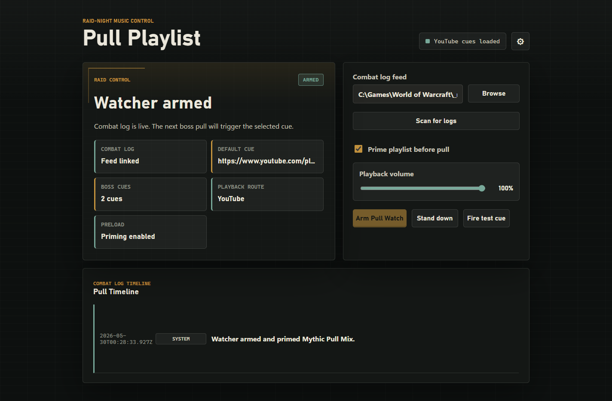
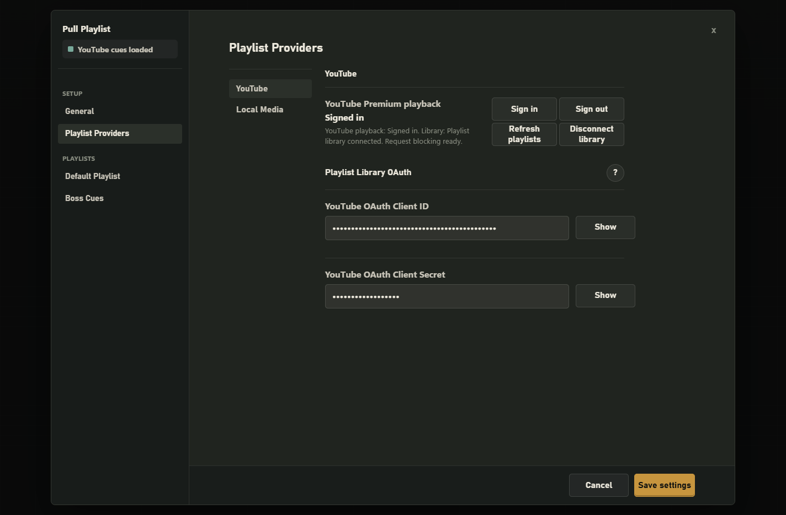
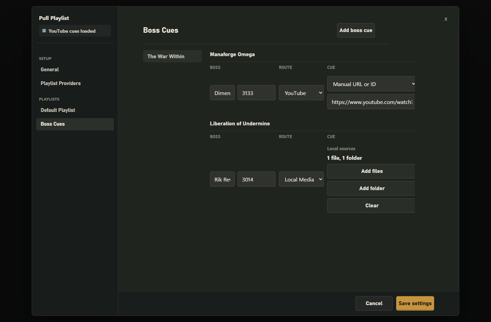

# WoW Pull Playlist Instructions

Use this walkthrough after installing WoW Pull Playlist or when setting up a new raid-night music profile.

## 1. Arm The Watcher

Enable combat logging in World of Warcraft:

```text
/combatlog
```

Open WoW Pull Playlist, select the active `WoWCombatLog.txt`, choose a default cue, then click **Arm Pull Watch** before the next boss pull.



## 2. Configure Playlist Providers

Open Settings and choose **Playlist Providers**. You can use manual YouTube URLs without OAuth, connect a YouTube playlist library to choose account playlists, or use local media files and folders.

For dependable ad-free YouTube playback, sign in with a YouTube Premium account from the YouTube account controls.



## 3. Add Boss Cues

Open **Boss Cues** to assign encounter-specific music. If a boss has a cue, that cue wins over the default playlist when the pull is detected. Local media cues can use individual files, folders, or both.



## 4. Start The Pull

Leave the watcher armed during the raid. When the app sees a pull start in the combat log, it opens the player window and starts the matching cue. Use **Fire test cue** before raid if you want to confirm the selected source and volume.
